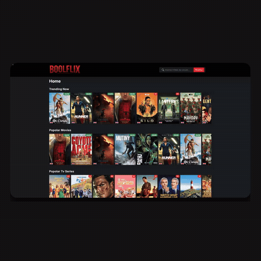

# ClipDev

ClipDev genera automaticamente, a partire dalla descrizione di un progetto software, un pacchetto pronto per un post su LinkedIn: un **video dimostrativo** (registrato navigando davvero nell'applicazione, con callout testuali ed effetti pensati per il feed), una **scaletta tecnica** della demo e **due varianti** del testo del post da pubblicare.

Non richiede editing video né scrittura manuale del post: basta indicare il progetto e l'indirizzo a cui è raggiungibile in locale, e ClipDev si occupa di analizzarlo, decidere cosa mostrare, registrarlo e scrivere il testo di accompagnamento.

## Cosa produce

Per ogni esecuzione, ClipDev crea quattro file:

| File | Contenuto | Cartella |
|---|---|---|
| `<progetto>-outline-<data>.json` | La scaletta della demo: obiettivo, tecnologie usate, sezioni del video (con le callout testuali e i loro timestamp), punti tecnici rilevanti | `output/` |
| `demo.mp4` | Il video della demo, con cursore visibile, ripple al click, callout testuali sincronizzate e interazioni realistiche, ottimizzato per la durata consigliata da LinkedIn (15-30 secondi). Full HD 16:9 (1920×1080) o quadrato 1:1 (1080×1080), a seconda del formato canvas scelto | `recordings/<slug-progetto>/` |
| `<progetto>-variante-a-social-post-<data>.md` | Variante A del post LinkedIn: taglio ingegneristico/storytelling, incentrata su scelte architetturali e tradeoff | `output/` |
| `<progetto>-variante-b-social-post-<data>.md` | Variante B del post LinkedIn: taglio product showcase, incentrata sull'esperienza utente e su una call-to-action verso il repository | `output/` |

## Esempio

Video generato da ClipDev, senza interventi manuali, per **BoolFlix**, un'applicazione React in stile Netflix per cercare film e serie TV con dati in tempo reale dalle TMDB API — esportato in formato quadrato (`--canvas=square`) per il feed mobile:

<p align="center">
  
</p>

La sequenza (scelta autonomamente dal Director Agent osservando la pagina reale, senza alcun elemento inventato): digitazione di una query nella barra di ricerca, click sul pulsante "Ricerca", apertura della card di un risultato, passaggio alla pagina di dettaglio e scorrimento per mostrarne il resto — con le callout testuali sincronizzate ("Righe scorrevoli Netflix-style", "Ricerca combinata film+TV"...) lette dalla scaletta dell'Analyst Agent e sovrimpresse in fase di montaggio. La GIF sopra è una versione compressa; il video originale in piena qualità (1080×1080) è in [`docs/demo.mp4`](docs/demo.mp4).

## Come funziona

ClipDev non è un unico strumento monolitico, ma una sequenza coordinata di passaggi, ciascuno con una responsabilità precisa:

1. **Analisi del progetto** — un agente (Claude Haiku 4.5, tramite LangChain.js) legge la descrizione del progetto (testo libero, README, changelog) e la trasforma in una scaletta strutturata per un video breve, seguendo le linee guida ufficiali di LinkedIn per i contenuti video. Per ogni sezione stima anche, quando può farlo con ragionevole sicurezza, una breve callout testuale (4-5 parole al massimo) con i suoi timestamp indicativi, pensata per essere sovrimpressa nel video in fase di montaggio.

2. **Ispezione della pagina** — in parallelo, Playwright apre un browser Chromium che visita l'indirizzo indicato, attende che la pagina sia completamente caricata (non solo il primo evento di caricamento, ma anche eventuali dati richiesti in modo asincrono all'avvio) e individua gli elementi reali con cui si può interagire (pulsanti, link, campi di input) leggendo lo stesso albero di accessibilità consultato dagli screen reader — non solo i tag HTML più comuni, ma anche i controlli costruiti con componenti custom o incapsulati in una Shadow DOM.

3. **Pianificazione delle interazioni** — un secondo agente (stesso modello, stesso framework) sceglie quali interazioni mostrare nel video (click, digitazione, scorrimento), **solo tra gli elementi realmente presenti sulla pagina**: non vengono mai inventati elementi che non esistono.

4. **Registrazione** — le interazioni scelte vengono eseguite con Playwright nello stesso browser, con un cursore visibile che si muove in modo naturale (non a scatti) e un ripple semitrasparente che si espande a ogni click, per restare leggibile anche su schermi piccoli. Prima di ogni click o digitazione, ClipDev verifica che l'elemento coinvolto sia visibile e abbia smesso di muoversi (utile con menu che si aprono con un'animazione o banner che si spostano durante il caricamento), e sostituisce automaticamente un eventuale valore segnaposto generico ("test", "asdf") con uno semanticamente plausibile prima di digitarlo in un campo. Se un'interazione fa comparire contenuti caricati da un servizio esterno (ad esempio le card di un catalogo prodotti), l'intervallo di attesa viene registrato e rimosso per intero in fase di montaggio (lo stesso "taglio del tempo morto" usato dagli strumenti professionali di registrazione demo), così nel video non compare mai lo stato di caricamento intermedio. Il risultato viene registrato in un video WebM.

5. **Montaggio** — il video WebM viene convertito in MP4 con ffmpeg, che in questo stesso passaggio applica anche il taglio del tempo morto, sovrimprime le callout testuali lette dalla scaletta e, se richiesto, incapsula la registrazione in un canvas quadrato per il feed mobile (vedi [Ottimizzazioni per l'engagement su LinkedIn](#ottimizzazioni-per-lengagement-su-linkedin)).

6. **Scrittura del post** — un terzo agente (stesso framework) trasforma la scaletta in due varianti di testo professionale pronte per LinkedIn, entrambe con un gancio nelle prime righe pensato per superare il "vedi altro".

7. **Salvataggio** — scaletta, video e le due varianti del post vengono scritti su disco.

Gli agenti che compiono i passaggi 1, 3 e 6 sono basati su intelligenza artificiale ma **non decidono autonomamente l'ordine delle operazioni**: la sequenza è coordinata da codice deterministico (`pipeline/clipDevPipeline.js`), che gestisce anche i casi di errore, i tempi di attesa e la sicurezza delle interazioni scelte (ad esempio, scarta automaticamente qualunque interazione che sembri distruttiva, come un pulsante di logout o di eliminazione). Ogni dato che attraversa un confine tra un agente e uno strumento — la scaletta, le interazioni pianificate, le callout, il formato canvas, le due varianti del post — viene validato con uno schema [Zod](https://zod.dev/) prima di essere usato, non dato per buono così com'è.

## Ottimizzazioni per l'engagement su LinkedIn

Queste funzionalità esistono per un motivo preciso: un video e un post pensati per il feed di LinkedIn hanno vincoli diversi da una demo tecnica per un pubblico che ha già scelto di guardarla con attenzione (una conferenza, una call con un cliente). Nel feed l'attenzione è scarsa, spesso senza audio, e la decisione di fermarsi o continuare a scorrere si prende in pochi secondi.

**Cursore visibile e ripple al click** — Il video registrato non mostra nativamente il puntatore del sistema operativo: ClipDev disegna un cursore che segue il movimento reale del mouse, con un'accelerazione e una leggera curva non rettilinea che imitano un movimento umano invece di un salto secco. A ogni click si aggiunge anche un cerchio semitrasparente che si espande e svanisce nel punto esatto dell'interazione: un dettaglio pensato per restare leggibile anche quando il video viene guardato su un telefono, dove il solo cursore rischia di passare inosservato a quella scala.

**Verifica di stabilità prima di ogni interazione** — Prima di calcolare il punto esatto verso cui muovere il cursore, ClipDev attende che l'elemento coinvolto sia visibile e abbia smesso di muoversi o ridimensionarsi (fino a 2 secondi, poi procede comunque con l'ultima posizione osservata). Senza questo controllo, un elemento ancora in transizione per un'animazione CSS o un rendering asincrono potrebbe non trovarsi più nel punto calcolato all'inizio nel momento in cui il click avviene davvero.

**Dati realistici nei campi di testo** — Se il valore scelto per un campo da compilare somiglia a un segnaposto palesemente generico ("test", "asdf", "lorem ipsum"...), ClipDev lo sostituisce con un valore plausibile dedotto dal contesto dell'elemento (un campo che sembra un'email riceve un'email vera, un campo di ricerca riceve una query plausibile, e così via): un video professionale non deve mostrare un campo compilato con un valore palesemente finto.

**Callout testuali sincronizzate** — Le pillole di testo semitrasparenti che compaiono nel video ("Filtro budget globale", "Sincronizzazione in tempo reale"...) vengono lette direttamente dalla scaletta prodotta dall'Analyst Agent e sovrimpresse da ffmpeg in fase di montaggio, con una breve dissolvenza in entrata e in uscita. Servono a comunicare cosa sta succedendo a schermo anche a chi guarda senza audio — la maggioranza del pubblico su LinkedIn. Se nessun font grassetto tra quelli noti (vedi [Requisiti](#requisiti)) è disponibile sul sistema, le callout vengono semplicemente saltate: il resto della conversione prosegue comunque.

**Due formati di canvas** — Il video registrato è sempre Full HD 16:9 (lo standard per il feed desktop), ma può essere esportato anche incapsulato in un canvas quadrato 1080×1080 (`--canvas=square`): la viewport registrata viene rimpicciolita e centrata, con angoli arrotondati, una leggera ombra e uno sfondo scuro minimale attorno. Un video quadrato occupa più spazio verticale nello schermo di un telefono rispetto a un widescreen con bande nere, il formato in cui la maggior parte del traffico su LinkedIn avviene.

**Due varianti del post, con un gancio pensato per il "vedi altro"** — Il Copywriter Agent non scrive un solo post, ma due, entrambe basate sugli stessi fatti dell'outline (nessuna invenzione), con angolazioni diverse:

- **Variante A — Ingegneristica/Storytelling**: costruita attorno a una scelta architetturale, un tradeoff o una sfida tecnica reale, per un pubblico più tecnico.
- **Variante B — Product Showcase**: costruita attorno al beneficio per chi usa il prodotto e a una call-to-action verso il repository, per un pubblico più ampio.

In entrambe, le prime 1-2 righe (l'unica parte visibile prima del "vedi altro") devono sollevare una sfida tecnica concreta o un insight architetturale reale: sono vietate le formule generiche da annuncio aziendale ("Excited to share", "Oggi vi mostro", "Ho il piacere di presentare") e un uso decorativo delle emoji in apertura.

## Stack tecnologico

| Livello | Tecnologia | Ruolo in ClipDev |
|---|---|---|
| Agenti AI | [LangChain.js](https://docs.langchain.com/) v1 (`createAgent`) + Claude Haiku 4.5 (`@langchain/anthropic`) | Analisi del progetto (con callout), scelta delle interazioni, scrittura delle due varianti del post |
| Automazione browser | [Playwright](https://playwright.dev/) (Chromium) | Navigazione, individuazione degli elementi della pagina, esecuzione delle interazioni, registrazione del video |
| Validazione dati | [Zod](https://zod.dev/) | Controllo della forma di ogni dato scambiato tra agenti e strumenti (outline, callout, interazioni, formato canvas, percorsi dei file) |
| Conversione video | ffmpeg (processo esterno) | Conversione del video registrato (WebM) in MP4, taglio del tempo morto, callout testuali, canvas quadrato |
| Runtime | Node.js, moduli ES nativi | Esecuzione dell'intero processo, nessun framework web coinvolto |

## Requisiti

- **Node.js** 20.6 o successivo per l'uso da riga di comando con `index.js` (richiede il flag `--env-file`, supportato dalla 20.6); 20.12 o successivo per il comando globale `clipdev` (richiede `process.loadEnvFile()`, l'API nativa equivalente ma con un requisito di versione leggermente più alto)
- **pnpm** come gestore di pacchetti
- **ffmpeg** installato e raggiungibile da riga di comando (necessario per convertire il video registrato nel formato finale, tagliare il tempo morto, sovrimprimere le callout e comporre il canvas quadrato). Su Windows: `winget install ffmpeg`; su macOS: `brew install ffmpeg`; su Linux: `apt install ffmpeg` o equivalente.
- Un **font grassetto di sistema**, solo se si vogliono le callout testuali nel video (facoltativo: senza, il video viene comunque generato correttamente, semplicemente senza callout). ClipDev cerca automaticamente, in ordine, i font più comuni su Windows (`Arial Bold`, `Segoe UI Semibold`), macOS (`Arial Bold`, `Helvetica`) e Linux (`DejaVu Sans Bold`, `Liberation Sans Bold`, `FreeSans Bold`): su un'installazione standard del sistema operativo è quasi sempre già presente, nessuna azione manuale richiesta.
- Una **chiave API di Anthropic**, ottenibile da [console.anthropic.com/settings/keys](https://console.anthropic.com/settings/keys)

## Installazione

```bash
pnpm install
npx playwright install chromium
```

Il secondo comando scarica il browser usato per la registrazione (necessario solo la prima volta).

## Configurazione della chiave API

Copia il file di esempio e inserisci la tua chiave:

```bash
cp .env.example .env
```

Poi modifica `.env` inserendo la chiave reale al posto del segnaposto:

```
ANTHROPIC_API_KEY=sk-ant-...
```

Il file `.env` è escluso dal controllo di versione: non va mai condiviso né incluso in commit.

## Utilizzo

### Da riga di comando, con parametri espliciti

```bash
node --env-file=.env index.js "Nome Progetto" "Descrizione tecnica del progetto..." "http://localhost:3000"
```

oppure, tramite lo script equivalente:

```bash
pnpm start -- "Nome Progetto" "Descrizione tecnica del progetto..." "http://localhost:3000"
```

I primi tre parametri sono, nell'ordine: nome del progetto, descrizione tecnica (più è dettagliata, migliore sarà la scaletta prodotta) e indirizzo a cui è raggiungibile il progetto in locale. Un quarto parametro facoltativo sceglie il formato del canvas del video:

```bash
node --env-file=.env index.js "Nome Progetto" "Descrizione..." "http://localhost:3000" square
```

Valori accettati: `widescreen` (default, 16:9, feed desktop) o `square` (1:1, feed mobile — vedi [Ottimizzazioni per l'engagement su LinkedIn](#ottimizzazioni-per-lengagement-su-linkedin)).

### Come comando globale, dentro un altro progetto

Una volta installato come comando globale (una tantum, dalla cartella di ClipDev):

```bash
pnpm link --global
```

ClipDev può essere lanciato semplicemente digitando `clipdev` da dentro la cartella di qualunque altro progetto:

```bash
clipdev
```

In questa modalità, ClipDev rileva automaticamente il nome del progetto, la sua descrizione (leggendo `README.md` o `package.json`) e prova a indovinare l'indirizzo del server di sviluppo in base al framework usato (Next.js, Vite, Angular, ecc.). Ogni rilevamento automatico resta comunque sovrascrivibile:

La qualità della scaletta generata dipende direttamente dalla qualità di questa descrizione: un `README.md` che spiega davvero cosa fa il progetto e quali funzionalità offre produce un outline pertinente, mentre un README assente o troppo generico (solo badge, istruzioni di installazione, nessuna descrizione delle funzionalità) lascia l'agente con poco materiale su cui basarsi, con il rischio di una scaletta vaga o poco accurata. In questi casi conviene passare una descrizione più completa con `--summary`, invece di affidarsi al rilevamento automatico.

```bash
clipdev --name="Nome Progetto" --summary="Descrizione..." --url="http://localhost:5173" --canvas=square
```

Parametri disponibili:

| Parametro | Descrizione | Default |
|---|---|---|
| `--name` | Nome del progetto | rilevato automaticamente |
| `--summary` | Descrizione tecnica del progetto | rilevato automaticamente |
| `--url` | Indirizzo del sito da registrare | rilevato automaticamente |
| `--headless` | `false` per vedere il browser durante la registrazione | `true` |
| `--duration` | Durata minima del video, in millisecondi | `5000` |
| `--canvas` | `widescreen` (16:9, feed desktop) o `square` (1:1, feed mobile) | `widescreen` |

Quando usato in questa modalità, la chiave API viene letta da `~/.clipdev.env` (nella cartella personale dell'utente), non dal file `.env` del progetto: crea quel file con lo stesso contenuto mostrato sopra, oppure imposta la variabile d'ambiente in modo permanente con `setx ANTHROPIC_API_KEY "sk-ant-..."` (Windows).

### Come libreria, per controllo completo

Per scegliere manualmente le interazioni da mostrare nel video (invece di lasciarle decidere all'agente), è possibile richiamare la funzione principale direttamente da uno script Node.js:

```js
import { runClipDevPipeline } from "./pipeline/clipDevPipeline.js";

const result = await runClipDevPipeline({
  projectName: "Nome Progetto",
  projectSummary: "Descrizione tecnica del progetto...",
  url: "http://localhost:3000",
  actions: [
    { type: "click", selector: "#apri-menu" },
    { type: "fill", selector: "#campo-ricerca", value: "esempio" },
    { type: "click", selector: "#cerca" },
  ],
  headless: true,
  minDurationMs: 8000,
  canvasFormat: "square", // oppure "widescreen" (default)
});

console.log(result.socialPostVariantA); // taglio ingegneristico/storytelling
console.log(result.socialPostVariantB); // taglio product showcase
console.log(result.files.videoPath);
```

Il risultato include sempre `outline` (la scaletta strutturata, con le callout di ciascuna sezione), `socialPostVariantA`/`socialPostVariantB` (il testo delle due varianti) e `files` (i percorsi di tutti i file salvati: `outlinePath`, `socialPostVariantAPath`, `socialPostVariantBPath`, `videoPath`).

## Struttura del progetto

```
ClipDev/
├── index.js                  Punto di avvio da riga di comando (parametri espliciti)
│
├── ai/
│   ├── agents/
│   │   ├── analystAgent.js     Trasforma la descrizione del progetto in una scaletta con callout
│   │   ├── directorAgent.js    Sceglie le interazioni da mostrare nel video
│   │   └── copywriterAgent.js  Scrive le due varianti del post per LinkedIn
│   └── models/
│       └── anthropic.js        Crea i modelli Claude condivisi dai tre agenti
│                                (qui avviene anche il controllo sulla chiave API)
│
├── bin/
│   └── clipdev.js             Comando globale `clipdev` (rilevamento automatico)
│
├── pipeline/
│   └── clipDevPipeline.js     Coordina l'intero processo, dall'analisi al salvataggio
│
├── tests/                     Test automatici (node --test) sulla logica pura e di
│                                sicurezza: validazione, filtri, rilevamento
│
└── tools/
    ├── browser/
    │   ├── recordDemoTool.js     Coordina la registrazione: pagina, interazioni, video
    │   ├── humanInteraction.js   Simula un'interazione umana (cursore, ripple, mouse,
    │   │                          scroll, stabilità dell'elemento, dati realistici)
    │   ├── pageInspection.js     Individua gli elementi con cui interagire sulla pagina
    │   ├── videoTranscode.js     Converte il video: taglio, callout, canvas quadrato
    │   └── recordingConfig.js    Dimensioni video e formati canvas condivisi tra i moduli
    ├── projectDetection.js    Interpreta i parametri e indovina l'URL del dev server
    └── saveOutputTool.js      Salva su disco scaletta e post; definisce lo schema
                                 dell'outline (incluse le callout) condiviso con l'Analyst
```

## Problemi comuni

**"ANTHROPIC_API_KEY non trovata"** — Verifica di aver creato il file `.env` (o `~/.clipdev.env` per il comando globale) con la chiave corretta, e di aver avviato con il flag `--env-file=.env` se usi `index.js` direttamente.

**"ffmpeg non è stato trovato nel PATH di sistema"** — ffmpeg non è installato, o non è raggiungibile da riga di comando. Installalo e riavvia il terminale.

**"Impossibile indovinare l'URL del dev server"** (solo con `clipdev` globale) — Il framework usato dal progetto non è tra quelli riconosciuti automaticamente, e nessuno script (`dev`/`start`) dichiara esplicitamente una porta (`--port`). Specifica l'indirizzo esplicitamente con `--url`.

**"Impossibile raggiungere http://localhost:PORTA"** (solo con `clipdev` globale) — L'indirizzo rilevato (o passato con `--url`) non risponde. Assicurati che il server di sviluppo del progetto sia già avviato prima di lanciare `clipdev`, oppure correggi la porta.

**Il video non contiene interazioni, solo la pagina ferma** — Può succedere se la pagina non ha elementi interattivi visibili al momento della registrazione (ad esempio se il contenuto è ancora in caricamento, o si trova dietro un `canvas`/`iframe`). Il log della console indica quanti elementi sono stati rilevati sulla pagina.

**Il video non ha le callout testuali** — Nessun font grassetto tra quelli noti (vedi [Requisiti](#requisiti)) è stato trovato sul sistema: il resto del video viene comunque prodotto normalmente, solo senza il testo sovrimpresso. Un messaggio in console lo segnala esplicitamente quando succede.

**"--canvas deve essere 'widescreen' o 'square'"** — Il valore passato al parametro del formato canvas (da riga di comando, o `canvasFormat` se usato come libreria) non è uno dei due valori accettati.

**La scaletta generata è vaga, generica o poco accurata** (solo con `clipdev` globale) — Il progetto non ha un `README.md` che descriva davvero le sue funzionalità, oppure ne è privo del tutto: senza una descrizione tecnica sufficiente, l'agente che genera l'outline ha poco materiale su cui basarsi. Passa una descrizione più dettagliata con `--summary="..."`.

## Nota sullo sviluppo

L'idea, l'obiettivo del prodotto e le scelte di design (come dev'essere fatto un video demo, cosa deve produrre lo strumento, quali garanzie di sicurezza deve rispettare) sono opera di chi lo ha ideato. Il codice è stato scritto con il supporto di un assistente AI e sottoposto, in seguito, a una revisione tecnica mirata, che ha incluso:

- controllo sistematico della gestione degli errori in ogni modulo (validazione degli input, timeout su ogni chiamata esterna — inclusa l'API di Anthropic —, pulizia delle risorse anche nei percorsi di fallimento);
- verifica dell'architettura scelta a confronto con la documentazione ufficiale di Anthropic e di LangChain.js, per accertare che il tipo di sistema realizzato (un processo coordinato in modo deterministico, non un agente pienamente autonomo) fosse davvero quello più adatto a questo caso d'uso;
- validazione empirica, con ffmpeg reale, della catena di filtri usata per le callout testuali e per il canvas quadrato (angoli arrotondati, ombra, sfondo), non solo dedotta dalla documentazione;
- rimozione del codice non più utilizzato;
- suddivisione dei file più estesi in moduli con una responsabilità ciascuno, per maggiore chiarezza;
- riscrittura dei commenti nel codice in linguaggio chiaro e verificabile anche da chi non programma;
- verifica dei controlli di sicurezza già presenti (interazioni limitate a siti in esecuzione in locale, esclusione automatica di azioni potenzialmente distruttive come logout o eliminazioni, protezione contro percorsi di file non validi).

## Licenza

ISC
